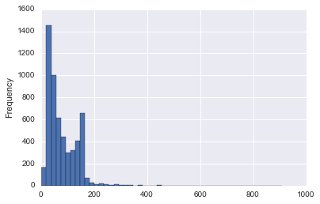
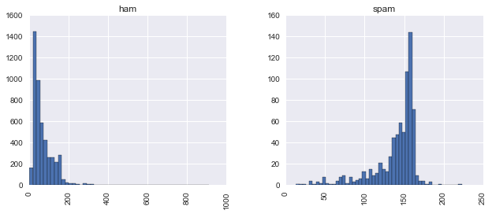

## Natural Language Processing

### Part1: Getting the Data
We'll be using a dataset from the UCI datasets!


```python
messages = [line.rstrip() for line in open('smsspamcollection/SMSSpamCollection')]
```


```python
print(len(messages))
```

    5574
    


```python
for num, message in enumerate(messages[:10]):
    print(num, message)
    print('\n')
```

    0 ham	Go until jurong point, crazy.. Available only in bugis n great world la e buffet... Cine there got amore wat...
    
    
    1 ham	Ok lar... Joking wif u oni...
    
    
    2 spam	Free entry in 2 a wkly comp to win FA Cup final tkts 21st May 2005. Text FA to 87121 to receive entry question(std txt rate)T&C's apply 08452810075over18's
    
    
    3 ham	U dun say so early hor... U c already then say...
    
    
    4 ham	Nah I don't think he goes to usf, he lives around here though
    
    
    5 spam	FreeMsg Hey there darling it's been 3 week's now and no word back! I'd like some fun you up for it still? Tb ok! XxX std chgs to send, £1.50 to rcv
    
    
    6 ham	Even my brother is not like to speak with me. They treat me like aids patent.
    
    
    7 ham	As per your request 'Melle Melle (Oru Minnaminunginte Nurungu Vettam)' has been set as your callertune for all Callers. Press *9 to copy your friends Callertune
    
    
    8 spam	WINNER!! As a valued network customer you have been selected to receivea £900 prize reward! To claim call 09061701461. Claim code KL341. Valid 12 hours only.
    
    
    9 spam	Had your mobile 11 months or more? U R entitled to Update to the latest colour mobiles with camera for Free! Call The Mobile Update Co FREE on 08002986030
    
    
    

Instead of parsing this tab separated values (TSV) file manually using Python, we can take advantage of Pandas


```python
import pandas
```


```python
messages = pandas.read_csv('smsspamcollection/SMSSpamCollection', sep = '\t', names = ['labels','message'])
```


```python
messages.head()
```


<div>
<table border="1" class="dataframe">
  <thead>
    <tr style="text-align: right;">
      <th></th>
      <th>labels</th>
      <th>message</th>
    </tr>
  </thead>
  <tbody>
    <tr>
      <th>0</th>
      <td>ham</td>
      <td>Go until jurong point, crazy.. Available only ...</td>
    </tr>
    <tr>
      <th>1</th>
      <td>ham</td>
      <td>Ok lar... Joking wif u oni...</td>
    </tr>
    <tr>
      <th>2</th>
      <td>spam</td>
      <td>Free entry in 2 a wkly comp to win FA Cup fina...</td>
    </tr>
    <tr>
      <th>3</th>
      <td>ham</td>
      <td>U dun say so early hor... U c already then say...</td>
    </tr>
    <tr>
      <th>4</th>
      <td>ham</td>
      <td>Nah I don't think he goes to usf, he lives aro...</td>
    </tr>
  </tbody>
</table>
</div>


### Basic Exploratory Data Analysis
We will check out some of the stats with some plots and the built-in methods in Pandas


```python
messages.describe()
```


<div>
<table border="1" class="dataframe">
  <thead>
    <tr style="text-align: right;">
      <th></th>
      <th>labels</th>
      <th>message</th>
    </tr>
  </thead>
  <tbody>
    <tr>
      <th>count</th>
      <td>5572</td>
      <td>5572</td>
    </tr>
    <tr>
      <th>unique</th>
      <td>2</td>
      <td>5169</td>
    </tr>
    <tr>
      <th>top</th>
      <td>ham</td>
      <td>Sorry, I'll call later</td>
    </tr>
    <tr>
      <th>freq</th>
      <td>4825</td>
      <td>30</td>
    </tr>
  </tbody>
</table>
</div>


```python
messages.info()
```

    <class 'pandas.core.frame.DataFrame'>
    RangeIndex: 5572 entries, 0 to 5571
    Data columns (total 2 columns):
    labels     5572 non-null object
    message    5572 non-null object
    dtypes: object(2)
    memory usage: 87.1+ KB
    


```python
messages.groupby('labels').describe()
```


<div>
<table border="1" class="dataframe">
  <thead>
    <tr style="text-align: right;">
      <th></th>
      <th></th>
      <th>message</th>
    </tr>
    <tr>
      <th>labels</th>
      <th></th>
      <th></th>
    </tr>
  </thead>
  <tbody>
    <tr>
      <th rowspan="4" valign="top">ham</th>
      <th>count</th>
      <td>4825</td>
    </tr>
    <tr>
      <th>unique</th>
      <td>4516</td>
    </tr>
    <tr>
      <th>top</th>
      <td>Sorry, I'll call later</td>
    </tr>
    <tr>
      <th>freq</th>
      <td>30</td>
    </tr>
    <tr>
      <th rowspan="4" valign="top">spam</th>
      <th>count</th>
      <td>747</td>
    </tr>
    <tr>
      <th>unique</th>
      <td>653</td>
    </tr>
    <tr>
      <th>top</th>
      <td>Please call our customer service representativ...</td>
    </tr>
    <tr>
      <th>freq</th>
      <td>4</td>
    </tr>
  </tbody>
</table>
</div>


```python
messages['length'] = messages['message'].apply(len)
messages.head()
```


<div>
<table border="1" class="dataframe">
  <thead>
    <tr style="text-align: right;">
      <th></th>
      <th>labels</th>
      <th>message</th>
      <th>length</th>
    </tr>
  </thead>
  <tbody>
    <tr>
      <th>0</th>
      <td>ham</td>
      <td>Go until jurong point, crazy.. Available only ...</td>
      <td>111</td>
    </tr>
    <tr>
      <th>1</th>
      <td>ham</td>
      <td>Ok lar... Joking wif u oni...</td>
      <td>29</td>
    </tr>
    <tr>
      <th>2</th>
      <td>spam</td>
      <td>Free entry in 2 a wkly comp to win FA Cup fina...</td>
      <td>155</td>
    </tr>
    <tr>
      <th>3</th>
      <td>ham</td>
      <td>U dun say so early hor... U c already then say...</td>
      <td>49</td>
    </tr>
    <tr>
      <th>4</th>
      <td>ham</td>
      <td>Nah I don't think he goes to usf, he lives aro...</td>
      <td>61</td>
    </tr>
  </tbody>
</table>
</div>


Now, on to visualization


```python
import matplotlib.pyplot as plt
import seaborn as sns
%matplotlib inline
```


```python
messages['length'].plot(bins=50,kind='hist')
```


    <matplotlib.axes._subplots.AxesSubplot at 0x19e51ead438>





```python
messages['length'].describe()
```


    count    5572.000000
    mean       80.489950
    std        59.942907
    min         2.000000
    25%        36.000000
    50%        62.000000
    75%       122.000000
    max       910.000000
    Name: length, dtype: float64


From the description above, we see that the longest message has length 910. We can try to find this message using masking


```python
messages[messages['length']==910]['message'].iloc[0]
```


    "For me the love should start with attraction.i should feel that I need her every time around me.she should be the first thing which comes in my thoughts.I would start the day and end it with her.she should be there every time I dream.love will be then when my every breath has her name.my life should happen around her.my life will be named to her.I would cry for her.will give all my happiness and take all her sorrows.I will be ready to fight with anyone for her.I will be in love when I will be doing the craziest things for her.love will be when I don't have to proove anyone that my girl is the most beautiful lady on the whole planet.I will always be singing praises for her.love will be when I start up making chicken curry and end up makiing sambar.life will be the most beautiful then.will get every morning and thank god for the day because she is with me.I would like to say a lot..will tell later.."


Let's see if message length is a distinguishing feature between Ham and Spam


```python
messages.hist(column='length', by='labels', bins=50, figsize=(10,4))
```


    array([<matplotlib.axes._subplots.AxesSubplot object at 0x0000019E522EB7B8>,
           <matplotlib.axes._subplots.AxesSubplot object at 0x0000019E52898898>], dtype=object)





From this visualization, we see that spam messages tend to have more characters

### Text Pre-processing

We need to process the text data into numerical features. The simplest approach is the Bag-of-words approach where each unique text is represented by one number. The frequency of occurrence of each word is used as a feature for training a classifier.

We will take a sequence of words and turn it into a vector of numbers


```python
import string
```


```python
mess = 'Sample message! Notice: it has punctuation'
```


```python
string.punctuation
```


    '!"#$%&\'()*+,-./:;<=>?@[\\]^_`{|}~'


```python
#first get rid of punctuatuion
nopunc =[char for char in mess if char not in string.punctuation]
nopunc = ''.join(nopunc)
nopunc
```


    'Sample message Notice it has punctuation'


```python
from nltk.corpus import stopwords
```


```python
stopwords.words('english')[0:10] #a subset of stopwords, i.e., words that are common in English and won't help with classification
```


    ['i', 'me', 'my', 'myself', 'we', 'our', 'ours', 'ourselves', 'you', 'your']


```python
nopunc.split() #split the messafe into a list of words
```


    ['Sample', 'message', 'Notice', 'it', 'has', 'punctuation']


```python
#Now remove any stopwords
clean_mess = [word for word in nopunc.split() if word.lower() not in stopwords.words('english')]
```


```python
clean_mess
```


    ['Sample', 'message', 'Notice', 'punctuation']


```python
#Now we put the text pre-processing steps above into a function
def text_process(mess):
    """
    Takes in a string of text, then performs the following:
    1. Remove all punctuation
    2. Remove all stopwords
    3. Returns a list of the cleaned text
    """
    #Check characters to see if they are in punctuation
    nopunc = [char for char in mess if char not in string.punctuation]
    
    #Join the characters to form a string
    nopunc = ''.join(nopunc)
    
    #Remove any stopwords
    return [word for word in nopunc.split() if word.lower() not in stopwords.words('english')]
    
```


```python
#Let's see the original DataFrame again
messages.head()
```


<div>
<table border="1" class="dataframe">
  <thead>
    <tr style="text-align: right;">
      <th></th>
      <th>labels</th>
      <th>message</th>
      <th>length</th>
    </tr>
  </thead>
  <tbody>
    <tr>
      <th>0</th>
      <td>ham</td>
      <td>Go until jurong point, crazy.. Available only ...</td>
      <td>111</td>
    </tr>
    <tr>
      <th>1</th>
      <td>ham</td>
      <td>Ok lar... Joking wif u oni...</td>
      <td>29</td>
    </tr>
    <tr>
      <th>2</th>
      <td>spam</td>
      <td>Free entry in 2 a wkly comp to win FA Cup fina...</td>
      <td>155</td>
    </tr>
    <tr>
      <th>3</th>
      <td>ham</td>
      <td>U dun say so early hor... U c already then say...</td>
      <td>49</td>
    </tr>
    <tr>
      <th>4</th>
      <td>ham</td>
      <td>Nah I don't think he goes to usf, he lives aro...</td>
      <td>61</td>
    </tr>
  </tbody>
</table>
</div>


Now we "tokenize" these messages. Tokenization is just the term used to describe the process of converting the normal text strings into a list of tokens (words that we actually want).


```python
messages['message'].head().apply(text_process)
```


    0    [Go, jurong, point, crazy, Available, bugis, n...
    1                       [Ok, lar, Joking, wif, u, oni]
    2    [Free, entry, 2, wkly, comp, win, FA, Cup, fin...
    3        [U, dun, say, early, hor, U, c, already, say]
    4    [Nah, dont, think, goes, usf, lives, around, t...
    Name: message, dtype: object


### Vectorization
Currently, we have the messages as lists of tokens (also known as lemmas) and now we need to convert each of those messages into a vector the SciKit Learn's algorithm models can work with.

Now we'll convert each message, represented as a list of tokens (lemmas) above, into a vector that machine learning models can understand.

We'll do that in three steps using the bag-of-words model:

    1. Count how many times a word occurs in each message (Known as term frequency)
    2. Weigh the counts, so that frequent tokens get lower weight (inverse document frequency)
    3. Normalize the vectors to unit length, to abstract from the original text length (L2 norm)

Let's begin the first step:


```python
from sklearn.feature_extraction.text import CountVectorizer
```


```python
bow_transformer = CountVectorizer(analyzer=text_process)
```


```python
bow_transformer.fit(messages['message'])
```


    CountVectorizer(analyzer=<function text_process at 0x0000019E53532E18>,
            binary=False, decode_error='strict', dtype=<class 'numpy.int64'>,
            encoding='utf-8', input='content', lowercase=True, max_df=1.0,
            max_features=None, min_df=1, ngram_range=(1, 1), preprocessor=None,
            stop_words=None, strip_accents=None,
            token_pattern='(?u)\\b\\w\\w+\\b', tokenizer=None, vocabulary=None)


```python
message5 = messages['message'][4]
print(message5)
```

    Nah I don't think he goes to usf, he lives around here though
    


```python
bow5 = bow_transformer.transform([message5])
```


```python
print(bow5)
```

      (0, 2948)	1
      (0, 4777)	1
      (0, 6123)	1
      (0, 6877)	1
      (0, 7842)	1
      (0, 10433)	1
      (0, 10450)	1
      (0, 10799)	1
    

This means that there are eight unique words in message number 5 (after removing common stop words such as "I"). Let's go ahead and check and confirm some of the words:


```python
print(bow_transformer.get_feature_names()[2948])
print(bow_transformer.get_feature_names()[4777])
```

    Nah
    around
    

Now we can use .transform on our Bag-of-Words (bow) transformed object and transform the entire DataFrame of messages. Let's go ahead and check out how the bag-of-words counts for the entire SMS corpus looks like. We expect to see a large, sparse matrix:


```python
messages_bow = bow_transformer.transform(messages['message'])
```


```python
print('Shape of Sparse Matrix: ', messages_bow.shape)
print('Amount of Non-Zero occurences: ', messages_bow.nnz)
print('sparsity: {0:.2f}%'.format((100.0 * messages_bow.nnz / (messages_bow.shape[0] * messages_bow.shape[1]))))
```

    Shape of Sparse Matrix:  (5572, 11425)
    Amount of Non-Zero occurences:  50548
    sparsity: 0.08%
    

### Term Frequency (TF) and Inverse Document Frequency (IDF)
TF: Term Frequency, which measures how frequently a term occurs in a document. Since every document is different in length, it is possible that a term would appear many more times in long documents than shorter ones. Thus, the term frequency is often divided by the document length (aka. the total number of terms in the document) as a way of normalization:

#### TF(t) = (Number of times term t appears in a document) / (Total number of terms in the document).

IDF: Inverse Document Frequency, which measures how important a term is. While computing TF, all terms are considered equally important. However it is known that certain terms, such as "is", "of", and "that", may appear a lot of times but have little importance. Thus we need to weigh down the frequent terms while scale up the rare ones, by computing the following:

#### IDF(t) = log_e(Total number of documents / Number of documents with term t in it).

See below for a simple example.

#### Example:

Consider a document containing 100 words wherein the word cat appears 3 times.

The term frequency (i.e., tf) for cat is then (3 / 100) = 0.03. Now, assume we have 10 million documents and the word cat appears in one thousand of these. Then, the inverse document frequency (i.e., idf) is calculated as log(10,000,000 / 1,000) = 4. Thus, the Tf-idf weight is the product of these quantities: 0.03 * 4 = 0.12.


```python
from sklearn.feature_extraction.text import TfidfTransformer

tfidf_transformer = TfidfTransformer().fit(messages_bow)
```


```python
tfidf5 = tfidf_transformer.transform(bow5)
```


```python
print(tfidf5)
```

      (0, 10799)	0.401901546254
      (0, 10450)	0.354070044444
      (0, 10433)	0.270435802512
      (0, 7842)	0.445743727362
      (0, 6877)	0.354070044444
      (0, 6123)	0.240902262921
      (0, 4777)	0.310422627151
      (0, 2948)	0.401901546254
    

What is the IDF (inverse document frequency) of the words "u" and "university"?


```python
print(tfidf_transformer.idf_[bow_transformer.vocabulary_['u']])
```

    3.28005242674
    


```python
print(tfidf_transformer.idf_[bow_transformer.vocabulary_['university']])
```

    8.5270764989
    


```python
messages_tfidf = tfidf_transformer.transform(messages_bow)
```


```python
print(messages_tfidf.shape)
```

    (5572, 11425)
    

### Training our model

With messages represented as vectors, we can finally train our spam/ham classifier. Now we can actually use almost any sort of classification algorithms. For a variety of reasons, the Naive Bayes classifier algorithm is a good choice.

We'll be using scikit-learn here, choosing the Naive Bayes classifier to start with:


```python
from sklearn.naive_bayes import MultinomialNB
```


```python
from sklearn.cross_validation import train_test_split

msg_train, msg_test, label_train, label_test = \
train_test_split(messages['message'],messages['labels'], test_size=0.2) #We specify 20% for testing. The default split would have been 30/70
```


```python
print(len(msg_train), len(msg_test), len(msg_train)+len(msg_test))
```

    4457 1115 5572
    

### Creating a Data Pipeline
Let's run our model again and then predict off the test set. We will use SciKit Learn's pipeline capabilities to store a pipline of workflow. This will allow us to set up all the transformations that we will do to the data for future use.


```python
from sklearn.pipeline import Pipeline

pipeline = Pipeline([('bow', CountVectorizer(analyzer=text_process)),
                    ('tfidf', TfidfTransformer()),
                    ('classifier', MultinomialNB())]
                    )
```

Now we can directly pass message text data and the pipeline will do our pre-processing for us! We can treat it as a model/estimator API:


```python
pipeline.fit(msg_train,label_train)
```


    Pipeline(steps=[('bow', CountVectorizer(analyzer=<function text_process at 0x0000019E53532E18>,
            binary=False, decode_error='strict', dtype=<class 'numpy.int64'>,
            encoding='utf-8', input='content', lowercase=True, max_df=1.0,
            max_features=None, min_df=1, ngram_range=(1, 1), preprocesso...f=False, use_idf=True)), ('classifier', MultinomialNB(alpha=1.0, class_prior=None, fit_prior=True))])


```python
predictions = pipeline.predict(msg_test)
```

### Model Evaluation


```python
from sklearn.metrics import classification_report
```


```python
print(classification_report(predictions,label_test))
```

                 precision    recall  f1-score   support
    
            ham       1.00      0.95      0.98      1017
           spam       0.67      1.00      0.80        98
    
    avg / total       0.97      0.96      0.96      1115
    
    
